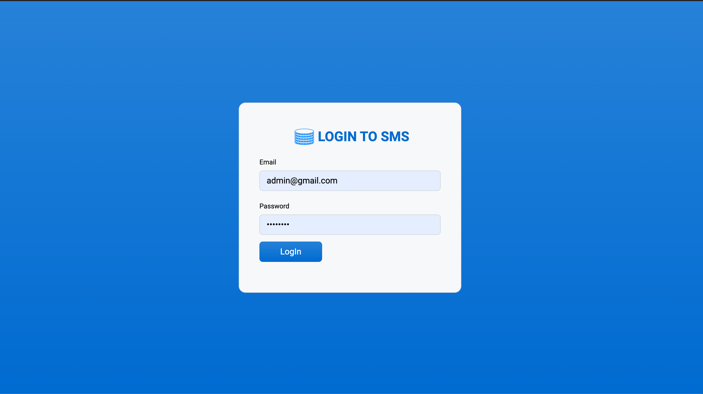
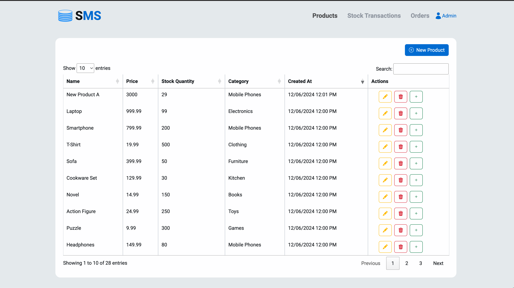

# Stock Management System (Code Test)

Welcome to the **Stock Management System**! This application demonstrates robust development practices, including a custom DI container, routing, authentication, and stock management features implemented in pure PHP.

---

## 🚀 Project Overview




This project is a full-fledged **Stock Management System** that facilitates:
- Product management (CRUD)
- Inventory tracking
- Purchase transactions
- User authentication with role-based access (Admin & User)

Built with modularity and maintainability in mind, the application follows best practices in MVC architecture, Bootstrap for UI, and PHPUnit for testing.

---

## 📂 Project Structure

The repository contains the following key folders:

- **`app`**: Core business logic and validation handling.
- **`config`**: Application configuration files.
- **`database`**: Contains dummy seeders.
- **`docker`**: Docker configuration for easy setup and deployment.
- **`migrations`**: SQL migration files for version-controlled database structure.
- **`resources`**: Views and assets for the application.
- **`tests`**: PHPUnit test cases for ensuring code quality.

---

## 🛠️ User Credentials

For testing purposes, the following user accounts are provided:

### 1. **Admin User**
- **Email**: admin@gmail.com
- **Password**: asdffdsa

This account has full administrative privileges and can manage products, orders, and stock movements.

### 2. **Regular User**
- **Email**: user1@example.com
- **Password**: asdffdsa

This account has limited access and can view products, place orders, and check purchase history.

You can use these credentials to log in and test the application's different functionalities based on user roles.

---

## 🛠️ Getting Started

### 1. Clone the Repository
```bash
git clone https://github.com/Htet-Shine-Htwe/stock-management-system.git
cd stock-management-system
```

### 2. Start the Environment Using Makefile
Run the following commands to manage the Docker environment:
bash
make up          # Start Docker
make up-build    # Build and start Docker
make down        # Stop Docker
--

## ✨ Features
### **Admin Role**
- **Products**:
  - CRUD operations for products.
  - Add stock for products.
  - Bulk load products.
  - View stock transaction records.
- **Orders**:
  - View order records.
  - Manage stock movements.

### **User Role**
- Browse products and stock availability.
- Create purchase orders.
- View purchase history.


## 🌐 API Endpoints

The backend API includes the following routes, as defined in the application's routing file:

### **Guest Routes**
- `GET /login`: Display the login page.
- `POST /login`: Handle user login.

### **Authentication**
- `POST /logout`: Log out the currently authenticated user.

### **Admin Routes**
- **Products**:
  - `GET /admin/products`: List all products.
  - `GET /admin/products/create`: Show the product creation form.
  - `GET /admin/products/edit/{product}`: Display the edit form for a specific product.
  - `POST /admin/products/store`: Store a new product.
  - `POST /admin/products/update/{product}`: Update an existing product.
  - `GET /admin/products/load`: Load bulk product data.
  - `DELETE /admin/products/delete/{product}`: Delete a specific product.
  - `POST /admin/products/add-stock/{product}`: Add stock to a product.
- **Orders**:
  - `GET /admin/orders`: List all orders.
  - `GET /admin/orders/load`: Load order data.
- **Stocks**:
  - `GET /admin/stocks`: List stock movements.
  - `GET /admin/stocks/get/{stockMovement}`: Get details of a specific stock movement.
  - `GET /admin/stocks/load`: Load stock data.

### **User Routes**
- **Products**:
  - `GET /products`: List all available products for users.
  - `GET /products/load`: Load product data for users.
- **Orders**:
  - `POST /purchase/order`: Place a new purchase order.
